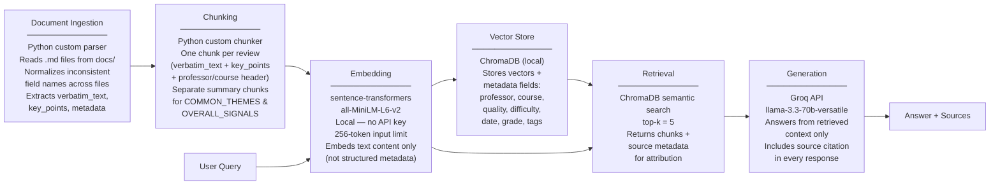

# Project 1 Planning: The Unofficial Guide

> Write this document before you write any pipeline code.
> Your spec and architecture diagram are what you'll use to direct AI tools (Claude, Copilot, etc.) to generate your implementation — the more specific they are, the more useful the generated code will be.
> Update the Retrieval Approach and Chunking Strategy sections if you change your approach during implementation.
> Update this file before starting any stretch features.

---

## Domain

The domain I chose is GSU CS professor reviews for core undergraduate courses. I am a CS student at Georgia State University and a problem I face every semester is browsing multiple sources to find the best CS faculty for a given course. This knowledge is valuable because it reflects real student experience — teaching style, exam difficulty, grading fairness — none of which appears in official course catalogs or department websites.

---

## Documents

| # | Source | Description | URL or location |
|---|--------|-------------|-----------------|
| 1 | Rate My Professors | Abdullah Bal — student reviews, CSC4520 / CSC6260 / CSC3210 | docs/professor_bal.md |
| 2 | Rate My Professors | Sayed Hossein Esfahani — student reviews, CSC1301 | docs/professor_esfahani.md |
| 3 | Rate My Professors | Lan Gao — student reviews, CSC3210 | docs/professor_gao.md |
| 4 | Rate My Professors | William Johnson — student reviews, CSC1302 | docs/professor_johnson.md |
| 5 | Rate My Professors | Amin Karim — student reviews, CSC1301 | docs/professor_karim.md |
| 6 | Rate My Professors | Kiril Kuzmin — student reviews, CSC4520 / CSC2510 / DATA1501 | docs/professor_kuzmin.md |
| 7 | Rate My Professors | Md Mahfuzur Rahman — student reviews, CSC3320 | docs/professor_rahman.md |
| 8 | Rate My Professors | Rajshekhar Sunderraman — student reviews, CSC1301 | docs/professor_sunderraman.md |
| 9 | Rate My Professors | Farhan Tanvir — student reviews, CSC4760 | docs/professor_tanvir.md |
| 10 | Rate My Professors | Islam S M Towhidul — student reviews, CSC3320 / CSC2720 / CSC1302 | docs/professor_towhidul.md |
| 11 | Rate My Professors | Yanqing Zhang — student reviews, CSC4810 | docs/professor_zhang.md |

---

## Chunking Strategy

**Chunk size:** ~300–600 characters per chunk, naturally varying by review length. No fixed character limit is enforced — each chunk maps to exactly one student review.

**Overlap:** 0. Reviews are already atomic, self-contained units. Overlapping across review boundaries would blend two different students' opinions into a single embedding, degrading retrieval precision.

**Reasoning:** The documents are structured around individual student reviews as the natural semantic unit. Fixed-character splitting would risk cutting mid-opinion and losing the professor/course context that makes a chunk attributable. Instead, each chunk is built from one review's verbatim text and key points, prefixed with professor name, course, rating, and date — so every retrieved chunk stands alone and can be cited. In addition to per-review chunks, the OVERALL_SIGNALS and COMMON_THEMES sections of each professor file are each stored as a separate summary chunk, which retrieves well for broad questions like "Is Professor Karim recommended overall?" Expected total chunk count: ~165–275 chunks across 11 professors (15–25 reviews each), well within the healthy 50–2,000 range.

**Embed/metadata split:** Each document contains substantial structured fields that carry no semantic meaning — SOURCE_ID, AGGREGATE_METRICS, RATING_DISTRIBUTION, SIMILAR_PROFESSORS, and per-review fields like for_credit, thumbs_up, textbook, online_class. Embedding these would pollute the chunk's vector with noise unrelated to what a student actually said. Only the semantically meaningful content is embedded (professor name, course, verbatim review text, key points). All structured fields are stored as ChromaDB metadata (professor, course, quality, difficulty, grade, date, sentiment, tags) — queryable for filtering but excluded from the embedding. This keeps cosine similarity driven purely by meaning, and enables metadata filtering by course, date range, or rating as a stretch feature.

---

## Retrieval Approach

**Embedding model:** `all-MiniLM-L6-v2` via `sentence-transformers`. Runs locally — no API key, no rate limits, no cost. Input limit is 256 tokens, which is sufficient for review-level chunks (one verbatim review + metadata header stays well under that limit).

**Top-k:** 5. Retrieving 5 chunks is enough to surface multiple reviews about the same professor for a specific query, while avoiding context dilution from loosely related results. If a query asks about a specific professor and course, 5 chunks should consistently cover that combination without pulling in unrelated professors.

**Production tradeoff reflection:** For a real deployment, the main tradeoffs to weigh when choosing an embedding model are: (1) **Context length** — `all-MiniLM-L6-v2`'s 256-token limit is fine for short reviews but would truncate longer documents like syllabi or housing guides; models like `text-embedding-3-small` (OpenAI) support up to 8191 tokens. (2) **Accuracy on domain-specific text** — general-purpose models like MiniLM are trained on web text and perform well on opinion/review language, but a fine-tuned model on academic or student-written text could improve retrieval precision. (3) **Multilingual support** — not a concern here since all reviews are in English, but a multilingual model like `paraphrase-multilingual-MiniLM-L12-v2` would be necessary for a broader student population. (4) **Latency and cost** — local models have zero marginal cost and no network latency but require compute on the host machine; API-hosted models (OpenAI, Cohere) offload compute but add per-token cost and network dependency. For this corpus size (~200 chunks), local inference is the right call.

---

## Evaluation Plan

| # | Question | Expected answer |
|---|----------|-----------------|
| 1 | Which professor should I take for CSC 1301? | Amin Karim — 4.8/5 overall, 96% would take again, difficulty 2.2/5; Rajshekhar Sunderraman is also strong at 4.8/5 and 80% would take again but rated harder (3.4/5 difficulty). Sayed Esfahani is the weakest option at 2.5/5 and only 28% would take again. |
| 2 | What kind of professor is Abdullah Bal? | Well-structured lecturer who emphasizes attendance as essential. Exams are straightforward and based on class examples. Lectures follow a review-preview-summary format. Few graded assignments but high stakes. Mixed feedback on communication — helpful in office hours but some report slow grading and poor email responsiveness. Overall 3.8/5, 70% would take again. |
| 3 | Does Professor Rahman offer extra credit? | Yes — multiple reviews mention up to 7 bonus points of extra credit (TopHat assignments and attendance). Students say these bonuses are essential for recovering from his tough exams, which many describe as long and rigorous. |
| 4 | What is Professor Esfahani's attendance policy? | Attendance is mandatory and tracked through Kahoot games held at the end of class. Multiple reviews confirm that participating in Kahoots is also the primary way to study for exams. |
| 5 | Is Professor Karim good for a student with no coding experience? | Yes — one student explicitly wrote "I was nervous about taking professor Karim's class because I have never taken a comp sci course before. Now I am working on an AI startup." Karim is rated 4.8/5, 96% would take again, with a difficulty of 2.2/5, and students consistently describe him as encouraging and accessible for first-time programmers. |

---

## Anticipated Challenges

1. **Inconsistent document formats across professor files.** During document inspection, two distinct formats were found: `professor_bal.md` uses fields like `term_or_date`, `rating_if_available`, `key_points`, and `sentiment_label`, while `professor_esfahani.md` uses `date`, `quality`, `for_credit`, `grade`, and `thumbs_up` with no `key_points` field at all. A single parsing script that assumes one format will silently drop fields or crash on the other. Every professor file must be inspected and the parser must normalize field names before chunking.

2. **Comparison queries may fail to retrieve across multiple professor files.** Q1 ("Which professor should I take for CSC 1301?") requires surfacing chunks from at least three different professor files (Esfahani, Karim, Sunderraman). With top-k=5, all five results could come from whichever professor file has the strongest individual embedding match, leaving the other two professors entirely absent from the context. The LLM would then give an incomplete comparison. A mitigation is to add OVERALL_SIGNALS / AGGREGATE_METRICS summary chunks per professor so broad queries have a higher chance of hitting multiple professors, but this failure mode may still surface in evaluation.

3. **Scattered facts degrade retrieval for specific policy questions.** Q4 ("What is Professor Esfahani's attendance policy?") is a specific factual query, but the answer — Kahoot-based attendance — appears as a one-line mention spread across many individual reviews rather than in a single concentrated chunk. If the top-k results happen not to include a review that mentions Kahoot, the LLM will either give an incomplete answer or say it doesn't have enough information even though the fact exists in the corpus.

---

## Architecture

---

## AI Tool Plan

**Milestone 3 — Ingestion and chunking:**
Tool: Claude. Input: the Documents section (listing all 11 professor .md files and their inconsistent formats), the Chunking Strategy section (review-level chunking, embed/metadata split, normalized field names), and the Architecture diagram. I will ask Claude to implement two things: (1) a parser that reads each professor .md file, normalizes the two different field formats into a consistent structure, and extracts verbatim_text and key_points as the embed text along with structured metadata fields; (2) a chunker that produces one chunk dict per review plus separate summary chunks from COMMON_THEMES and OVERALL_SIGNALS sections. I will verify the output by printing 5 random chunks and confirming each is readable, contains a professor name, and has no leftover structured fields in the embedded text.

**Milestone 4 — Embedding and retrieval:**
Tool: Claude. Input: the Retrieval Approach section (all-MiniLM-L6-v2, ChromaDB, top-k=5), the Architecture diagram, and the chunk dict format produced in Milestone 3. I will ask Claude to implement a script that loads the chunks, embeds the text field using sentence-transformers, and stores each chunk in ChromaDB with its metadata fields attached. I will also ask it to implement a retrieval function that accepts a query string and returns the top 5 chunks with their source metadata. I will verify by running 3 of the 5 evaluation questions and manually checking whether the returned chunks visibly relate to each query.

**Milestone 5 — Generation and interface:**
Tool: Claude. Input: the grounded generation requirement from the project instructions (answers from retrieved context only, no general knowledge), the Groq model choice (llama-3.3-70b-versatile), the retrieval function from Milestone 4, and the Gradio interface skeleton from the project instructions. I will ask Claude to implement a prompt template that passes retrieved chunks as context and explicitly instructs the model not to answer beyond what the documents contain, and to cite the source document in every response. I will also ask it to wire this into a Gradio interface with a question input, answer output, and sources output. I will verify grounding by asking a question that my documents do not cover and confirming the system declines to answer rather than generating a plausible-sounding response from general knowledge.
